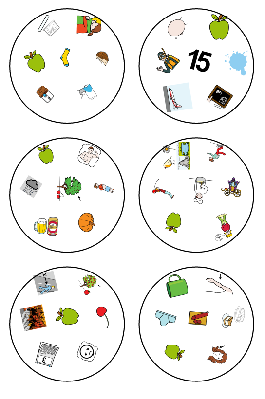

# DOBBLE to print

**DOBBLE to print** is a Python repository that privdes an easy to use script to generate a DOBBLE printable version from your symbols.



## Compatibility

Tested just with Linux and Python 3.6 but it should works also with OSX, Windows and Python >=3.6

## Installing

Execute the following command to install all the needed packages in your 
```
pip install -r requirements.txt
``` 
to install all the needed packages.


## Generate dobble.pdf

Execute the following command in order to generate the pdf.

You can generate cards with 5, 6 or 7 cards that would need 21, 31 and 43 symbols repectively as input.

``` 
python dobble.py \
    --num_symbols=7 \
    --symbols_path=./example_symbols \
    --out_name=dobble_to_print.pdf \
    --out_path=./output_path
```